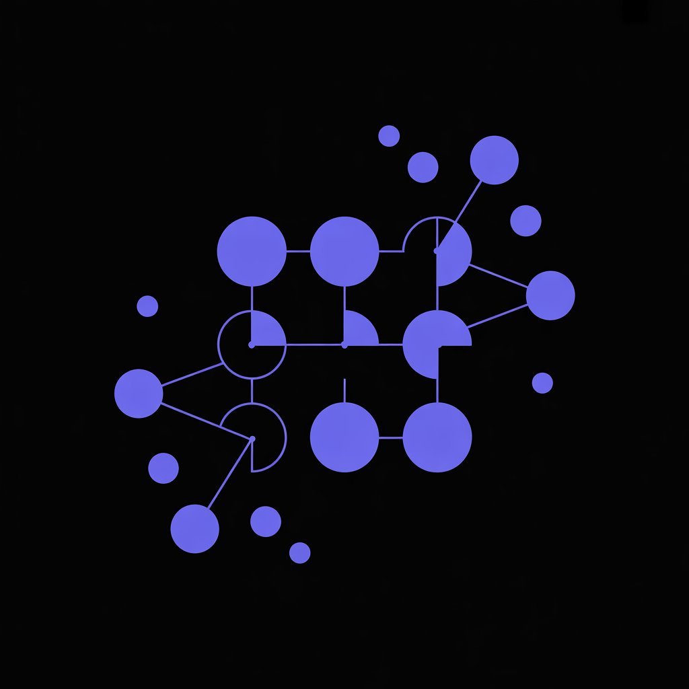
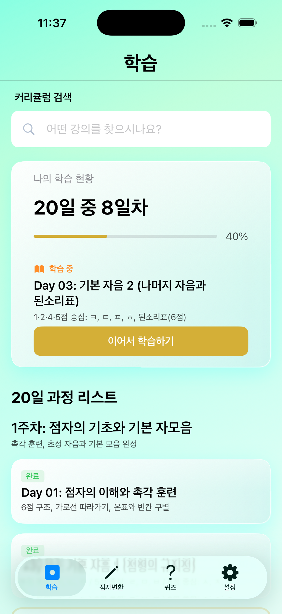
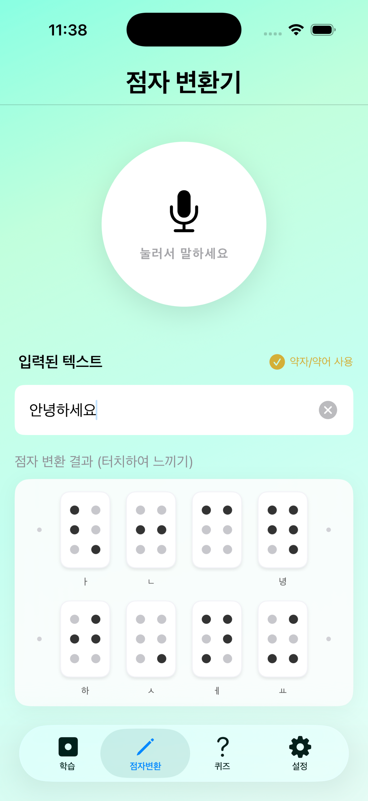
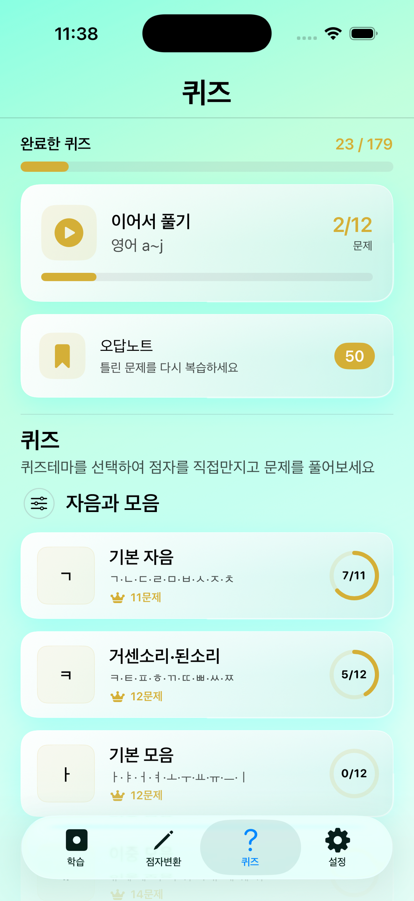
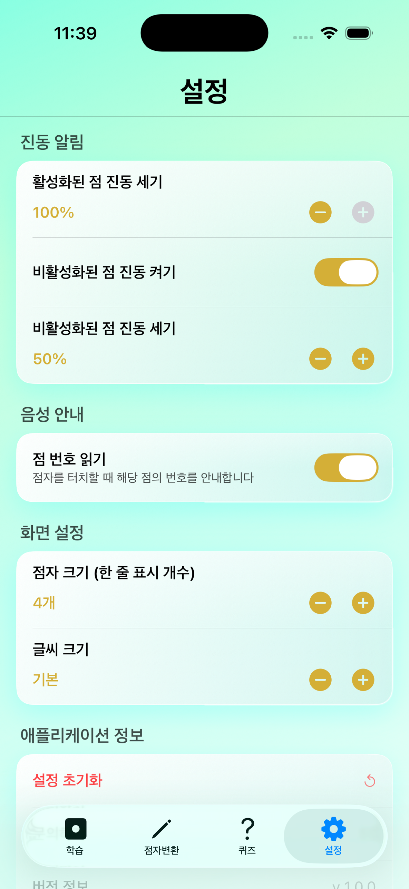

<div align="center">
  

  # BrailleTranslatorApp

  > 진동(햅틱)으로 점자를 **느끼며** 배우는 iOS 점자 교육 앱
</div>

시각장애인 사용자를 1순위 사용자로 가정하고 설계된 한글 점자 학습/번역 앱입니다.
CoreHaptics 기반 햅틱 피드백, VoiceOver 지원, 2024 개정 한국 점자 규정에 따른 번역 로직을 갖추고 있습니다.

---

## 스크린샷

| 학습 (커리큘럼) | 점자 변환기 | 퀴즈 | 설정 |
|:---:|:---:|:---:|:---:|
|  |  |  |  |
| 진도/이어서 학습 | 음성 입력 + 6점 셀 출력 | 카테고리 + 오답노트 | 햅틱·음성·표시 설정 |

---

## 목차
- [주요 기능](#주요-기능)
- [기술 스택](#기술-스택)
- [아키텍처](#아키텍처)
- [파일 구조](#파일-구조)
- [데이터 스키마](#데이터-스키마)
- [커리큘럼 구성](#커리큘럼-구성)
- [핵심 컴포넌트](#핵심-컴포넌트)
- [접근성 원칙](#접근성-원칙)

---

## 주요 기능

| 탭 | 설명 |
|---|---|
| **학습 (커리큘럼)** | 4주(20일차) 단계별 점자 학습 — 자음/모음/받침/숫자/약자/영어 |
| **번역기** | 한글 ↔ 점자 변환, 음성 인식(STT) 입력, 단어 저장 |
| **퀴즈** | 객관식 / O·X 퀴즈, 오답 노트, 카테고리별 진행 |
| **설정** | 점자 셀 크기, 진동 세기, 점 번호 안내, 폰트 크기 |

---

## 기술 스택

- **언어/플랫폼**: Swift 5, iOS
- **UI**: SwiftUI (메인) + UIKit (`BrailleTouchView` 6점 셀)
- **데이터**: SwiftData (`@Model`) + `@AppStorage` (UserDefaults)
- **햅틱**: CoreHaptics (`HapticManager` 싱글톤)
- **음성**: Speech (`SFSpeechRecognizer`)
- **아키텍처**: MVVM (선택적 적용 — 로직이 있는 화면에만 ViewModel)

---

## 아키텍처

Clean Architecture 풍의 3계층 구조 + MVVM의 선택적 적용.

```
┌─────────────────────────────────────────────┐
│  Presentation  (SwiftUI Views, ViewModels)  │
│  ─────────────────────────────────────────  │
│  RootTabView ─ Curriculum / Translator /    │
│                Quiz / Settings              │
└──────────────────┬──────────────────────────┘
                   │ uses
┌──────────────────▼──────────────────────────┐
│  Domain  (순수 모델 · 서비스)                │
│  ─────────────────────────────────────────  │
│  BrailleLetterItem · QuizQuestion ·         │
│  BrailleTranslator · HapticManager          │
└──────────────────┬──────────────────────────┘
                   │ persists via
┌──────────────────▼──────────────────────────┐
│  Data  (SwiftData @Model)                   │
│  ─────────────────────────────────────────  │
│  LearningItem · SavedWord · QuizAttempt     │
└─────────────────────────────────────────────┘
```

### MVVM 적용 범위
| 화면 | 상태 관리 | 이유 |
|---|---|---|
| `TranslatorView` | `TranslatorViewModel` | STT, 권한, 오디오 엔진 등 사이드 이펙트 多 |
| `QuizView` | `QuizViewModel` | 세션/오답/네비게이션 복잡 |
| `DayXView` (커리큘럼) | `@State` + `DayXData.swift` | 정적 데이터를 step별로 표시하는 표현 중심 |
| `SettingView` | `BrailleSettings` (`@AppStorage`) | UserDefaults 직접 바인딩 |

---

## 파일 구조

```
BrailleTranslatorApp/
├── BrailleTranslatorApp/             # 앱 엔트리 + 에셋
│   ├── BrailleTranslatorAppApp.swift # @main, ModelContainer, 커리큘럼 시딩
│   ├── ContentView.swift
│   └── Assets.xcassets
│
├── Data/                             # 영속 계층 (SwiftData)
│   └── Models/
│       ├── LearningItem.swift        # 학습 일차(진도)
│       ├── SavedWord.swift           # 번역기 저장 단어
│       ├── QuizAttempt.swift         # 퀴즈 시도/오답
│       └── Item.swift                # (템플릿 잔존)
│
├── Domain/                           # 도메인 계층
│   ├── Model/
│   │   ├── BrailleLetterItem.swift   # 점자 표시 단위 (이름/글자/점형)
│   │   ├── QuizQuestion.swift        # 객관식 + O/X 문제
│   │   └── QuizCategory.swift        # 퀴즈 카테고리
│   └── Service/
│       ├── BrailleTranslator.swift   # 한글 → 점자 변환 (2024 규정)
│       └── HapticManager.swift       # CoreHaptics 싱글톤
│
├── Presentation/                     # 표현 계층
│   ├── RootTabView.swift             # 4탭 루트
│   ├── ViewModel/
│   │   ├── TranslatorViewModel.swift
│   │   └── QuizViewModel.swift
│   ├── Components/                   # 공통 UI
│   │   ├── BrailleTouchView.swift    # UIKit 6점 셀 (핵심)
│   │   ├── BrailleCanvasView.swift   # SwiftUI 래퍼
│   │   ├── CommonCardView.swift
│   │   ├── CommonNavigationBar.swift
│   │   ├── CurriculumProgressBar.swift
│   │   ├── CurriculumStepHeader.swift
│   │   ├── CurriculumPracticeView.swift
│   │   ├── CurriculumExplanationView.swift
│   │   ├── ExplanationChalkboardCard.swift
│   │   ├── LearningButtonSection.swift
│   │   ├── QuizResultSheet.swift
│   │   ├── CircularProgressView.swift
│   │   └── Design/                   # DesignSystem (Color/Card/Background)
│   ├── Extensions/
│   │   └── String+Accessibility.swift
│   └── Screens/
│       ├── Cirriculum/
│       │   ├── CirriculumView.swift  # 커리큘럼 목록
│       │   ├── PracticeView.swift    # 공통 실습 화면
│       │   └── Day1/ ~ Day20/        # 일차별
│       │       ├── DayNView.swift          # 컨테이너 (step 관리)
│       │       ├── DayNIntroView.swift     # 도입부
│       │       └── DayNData.swift          # 정적 학습 데이터
│       ├── Translator/
│       │   └── TranslatorView.swift
│       ├── Quiz/
│       │   ├── QuizView.swift
│       │   ├── QuizCategoryListView.swift
│       │   ├── QuizSolvingView.swift
│       │   ├── QuizOXView.swift
│       │   ├── QuizChoiceExplorerView.swift
│       │   ├── QuizSessionCompleteView.swift
│       │   ├── WrongAnswerListView.swift
│       │   ├── WrongAnswerDetailView.swift
│       │   ├── WrongAnswerOXDetailView.swift
│       │   └── QuizData.swift              # 카테고리/문제 풀
│       └── Settings/
│           ├── SettingView.swift
│           └── BrailleSettings.swift       # @AppStorage 래퍼
│
├── BrailleTranslatorAppTests/
└── BrailleTranslatorAppUITests/
```

---

## 데이터 스키마

### 영속 모델 (SwiftData `@Model`)

앱 시작 시 `BrailleTranslatorAppApp.init`에서 `ModelContainer`를 만들고
스키마에 등록되는 영속 엔터티는 다음 2개입니다.

```swift
Schema([
    LearningItem.self,
    QuizAttempt.self
])
```

#### `LearningItem` — 학습 일차(진도)
| 필드 | 타입 | 설명 |
|---|---|---|
| `day` | `Int` *(unique)* | 1~20 일차 식별자 |
| `title` | `String` | 일차 제목 |
| `subtitle` | `String` | 일차 부제 |
| `isCompleted` | `Bool` | 완료 여부 (체크박스) |
| `isInProgress` | `Bool?` | 학습 중 여부 |
| `lastStepIndex` | `Int?` | 마지막 학습 step 인덱스 |
| `lastStepLabel` | `String?` | 마지막 학습 step 표시 텍스트 |

> 시딩: `BrailleTranslatorAppApp.curriculumData` → 첫 실행 또는 `curriculumVersion` 상승 시 자동 업데이트.
> 
#### `QuizAttempt` — 퀴즈 시도/오답
| 필드 | 타입 | 설명 |
|---|---|---|
| `id` | `UUID` | 시도 식별자 |
| `categoryId` | `String` | 카테고리 ID |
| `questionText` | `String` | 문제 텍스트 |
| `correctLetter` | `String` | 정답 글자 |
| `correctDotLabel` | `String` | 정답 점형 (`"1·4점"`) |
| `correctRawDots` | `String?` | 직접 점형 표기 |
| `userSelectedLetter` | `String` | 사용자 선택 |
| `isCorrect` | `Bool` | 정답 여부 |
| `isOXQuestion` | `Bool` | O/X 문제 여부 |
| `explanation` | `String?` | O/X 해설 |
| `timestamp` | `Date` | 시도 시각 |

---

### 도메인 값 타입 (영속 X)

#### `BrailleLetterItem` — 점자 표시 단위
화면에 점자 1글자/1셀을 그릴 때 쓰는 핵심 데이터 구조.

| 필드 | 타입 | 설명 |
|---|---|---|
| `name` | `String` | 짧은 이름 (`"기역"`) |
| `letter` | `String` | 표시 글자 (`"ㄱ"`) |
| `dotLabel` | `String` | 점형 (`"1·4점"`, `"ㄱ(1점) + ㅅ(3점)"`) |
| `cellsPerLine` | `Int?` | 셀 표시 폭 |
| `rawDots` | `String?` | 번역기 우회용 raw 점형 (`"1"`, `"25"`) |
| `rawDotLabels` | `String?` | rawDots 셀별 레이블 (콤마 구분) |
| `fromDotLabel` | `String?` | 변환 전 점형 (설명뷰 → 표시) |
| `voiceOverName` | `String?` | VoiceOver 전용 긴 이름 |

파생 프로퍼티: `activeDotNumbers`, `compoundDotSets`, `isCompoundDot` 등으로
`dotLabel`을 셀별 점 번호 집합으로 파싱.

#### `QuizQuestion` — 퀴즈 문제
```swift
enum QuizType { case multipleChoice, oxQuestion }
```
| 필드 | 타입 | 설명 |
|---|---|---|
| `type` | `QuizType` | 객관식 / O·X |
| `questionText` | `String` | 문제 |
| `correctItem` | `BrailleLetterItem` | 정답 |
| `choices` | `[BrailleLetterItem]` | 객관식 보기 (셔플) |
| `displayedItem` | `BrailleLetterItem?` | O/X 표시 점자 |
| `isCorrectPairing` | `Bool?` | O/X 정답 쌍 여부 |
| `explanation` | `String?` | O/X 해설 |
| `categoryId` | `String` | 카테고리 |

#### `QuizCategory`
| 필드 | 타입 | 설명 |
|---|---|---|
| `id` | `String` | 카테고리 ID |
| `title` / `subtitle` | `String` | 표시명 |
| `section` | `Int` | 1=감각, 2=기초, 3=실전 |
| `questionPool` | `() -> [BrailleLetterItem]` | 문제 풀 생성 |

---

### 설정 (UserDefaults / `@AppStorage`)

`BrailleSettings`가 보유하는 키:

| 키 | 타입 | 기본값 | 의미 |
|---|---|---|---|
| `cellsPerLine` | `Int` | `4` | 한 줄 점자 셀 수 |
| `activeDotIntensity` | `Double` | `1.0` | 활성 점 진동 세기 |
| `inactiveDotIntensity` | `Double` | `0.5` | 비활성 점 진동 세기 |
| `isInactiveDotFeedbackEnabled` | `Bool` | `true` | 비활성 점 햅틱 ON/OFF |
| `isDotNumberAnnouncementEnabled` | `Bool` | `true` | 점 번호 음성 안내 |
| `appFontSize` | `Int` | `0` | -1=작게 / 0=기본 / 1=크게 / 2=아주 크게 |
| `curriculumVersion` | `Int` | — | 시딩 버전 (직접 키 사용) |

---

## 커리큘럼 구성

| 섹션 | 일차 | 주제 |
|---|---|---|
| **1. 감각 깨우기** | 1~5 | 6점 구조, 기본 자음, 모음, 이중 모음 |
| **2. 한글 기초** | 6~10 | 받침, 숫자, 총정리 |
| **3. 실전 규칙·약자** | 11~15 | 'ㅏ' 생략 약자, 묶음 약자, 7개 약어 |
| **4. 영어·실생활** | 16~20 | 알파벳, 문장부호, 연산기호, 융합 읽기 |

각 일차는 다음 파일 셋으로 구성됩니다.

```
DayN/
├── DayNView.swift       # step enum + 컨테이너
├── DayNIntroView.swift  # 도입 화면
└── DayNData.swift       # [BrailleLetterItem] 정적 데이터
```

---

## 핵심 컴포넌트

| 컴포넌트 | 역할 |
|---|---|
| `BrailleTouchView` | UIKit 6점 셀 — 손가락으로 점을 만지면 햅틱 + VoiceOver 안내 |
| `BrailleCanvasView` | 위 컴포넌트의 SwiftUI 래퍼 |
| `BrailleTranslator` | 한글 → 점자 변환 (초·중·종성 분해, 약자/숫자/영어 규칙 적용) |
| `HapticManager` | CoreHaptics 싱글톤 — 모든 진동은 여기로 통일 |
| `BrailleSettings` | 설정 상태 컨테이너 (@AppStorage) |

---

## 접근성 원칙

1. **모든 인터랙티브 요소에 `accessibilityLabel` 필수**
2. **VoiceOver ON 시 두 손가락 스와이프**, 
3. **Dynamic Type 지원** + 자체 `appFontSize` 4단계
4. **점자 셀은 직접 터치 제스처** 우선 (`.allowsDirectInteraction`)
5. **점 번호 음성 안내** 토글 가능

---

## 빌드 / 실행

```bash
open BrailleTranslatorApp.xcodeproj
# Xcode → ⌘R
```

### 요구 환경
- **iOS**: 17.0+ (SwiftData 사용)
- **Xcode**: 15+
- **실기기 권장**: 시뮬레이터에서는 CoreHaptics 진동 / 마이크(STT) 동작이 제한됩니다.

### 권한
| 권한 | Info.plist 키 | 사용 목적 |
|---|---|---|
| 마이크 | `NSMicrophoneUsageDescription` | 번역기 음성 입력 |
| 음성 인식 | `NSSpeechRecognitionUsageDescription` | 한국어 STT (`SFSpeechRecognizer`) |

> SwiftData 스키마가 변경되면 시뮬레이터의 앱을 삭제 후 재실행하거나
> `curriculumVersion` 값을 올려 마이그레이션을 트리거하세요.

---

## 라이선스 / 크레딧
- 점자 규정: **2024 개정 한국 점자 규정** (국립국어원)
- 교육 자료: “본 콘텐츠는 행복나눔재단의 「한글점자 기초교육 가이드」를 참고하여 재구성되었습니다.”
- 개발: 노기승
